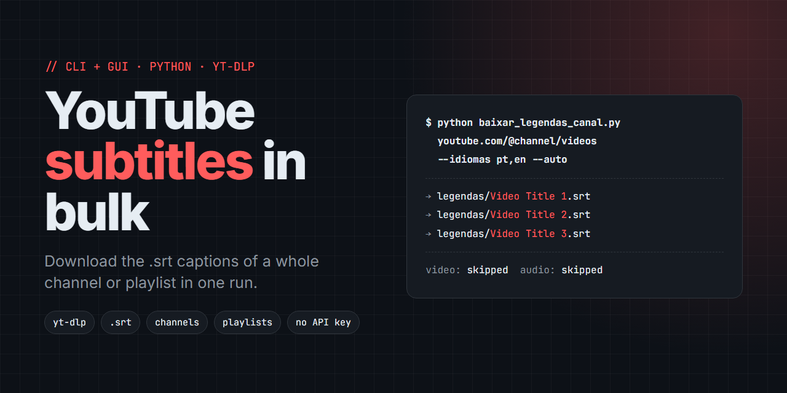

# Baixar Legendas YouTube: baixe legendas do YouTube (SRT) em massa de canais inteiros e playlists



**Baixar Legendas YouTube** é um script Python de linha de comando, com uma interface gráfica opcional para desktop, que baixa as legendas `.srt` de um único vídeo, de um canal inteiro do YouTube, de uma playlist ou de uma lista de URLs colada, tudo de uma vez. É feito com yt-dlp e pywebview e não precisa de chave da API do YouTube.

O YouTube não tem um jeito nativo de pegar todas as legendas de um canal ou playlist de uma vez, e baixar vídeo por vídeo é lento. Esta ferramenta passa as URLs para o yt-dlp, pula o vídeo e o áudio e salva só as legendas.

> baixar legendas do YouTube · baixar legendas de vídeos do YouTube · baixar SRT em massa · transcrições de canal · legendas de playlist · legendas com yt-dlp · legendas geradas automaticamente

## Funcionalidades

- **Vídeo, canal ou playlist.** Passe qualquer combinação de URLs. O yt-dlp expande canais (`.../videos`) e playlists para todos os vídeos.
- **Saída em SRT.** As legendas são convertidas para `.srt` com o ffmpeg.
- **Escolha de idioma.** O padrão é `pt,pt-BR,en`; passe qualquer lista separada por vírgulas.
- **Legendas geradas automaticamente.** A flag opcional `--auto` inclui as legendas automáticas do YouTube.
- **Não para nos erros.** Um vídeo sem legenda nos idiomas pedidos é pulado e o resto continua.
- **Só legendas.** Nunca baixa vídeo nem áudio.
- **Interface gráfica opcional.** Uma janelinha em pywebview com campo de URLs, campo de idiomas, seletor de pasta, caixa de legendas automáticas e log em tempo real.

## Tecnologias

| Tecnologia | Versão | Usada para |
|---|---|---|
| Python | 3.9+ | Execução (o código usa type hints `list[str]`, que precisam do 3.9+) |
| yt-dlp | sem versão fixa no `requirements.txt` | Buscar e baixar as legendas |
| pywebview | sem versão fixa no `requirements.txt` | Janela nativa da interface gráfica opcional (`gui.py`) |
| pythonnet | sem versão fixa; instalado só quando `sys_platform == "win32"` | Backend do pywebview no Windows |
| ffmpeg | externo, não é um pacote Python | Converte as legendas para `.srt` |

## Primeiros passos

Requisitos: Python 3.9 ou mais recente, e `ffmpeg` no seu `PATH`.

```bash
git clone https://github.com/WednyFernandes/baixar-legendas-youtube.git
cd baixar-legendas-youtube
pip install -r requirements.txt
```

## Como usar

### Linha de comando

```bash
python baixar_legendas_canal.py https://www.youtube.com/@channel/videos
```

Aceita um vídeo, um canal ou uma playlist, sozinhos ou combinados:

```bash
python baixar_legendas_canal.py https://www.youtube.com/watch?v=XXXX
python baixar_legendas_canal.py URL1 URL2 URL3
python baixar_legendas_canal.py URL --idiomas en,es --saida subs --auto
```

Os arquivos são salvos como `<output folder>/<video title>.srt`.

| Argumento | Padrão | Descrição |
|---|---|---|
| `urls` | obrigatório | Uma ou mais URLs: vídeo, canal (`.../videos`) ou playlist |
| `--idiomas` | `pt,pt-BR,en` | Idiomas das legendas, separados por vírgula |
| `--saida` | `legendas` | Pasta de saída dos arquivos `.srt` |
| `--auto` | desligado | Inclui legendas geradas automaticamente quando não existe uma manual |

### Interface gráfica (desktop)

```bash
python gui.py
```

Cole uma URL por linha (vídeo, canal, playlist ou uma lista misturada), defina os idiomas e a pasta de saída, marque a caixa de legendas automáticas se precisar e comece. O log mostra uma linha `Baixado: <file>` para cada legenda e `Concluido.` no final.

## Como funciona

O script chama o `yt_dlp` diretamente e passa a lista de URLs para `ydl.download(urls)`. O yt-dlp detecta se cada URL é um vídeo, um canal ou uma playlist e a expande, então todos os casos seguem pelo mesmo caminho no código. Ele roda com `skip_download=True` e `writesubtitles=True` (mais `writeautomaticsub` quando `--auto` está ligado) e converte o resultado para `.srt` pelo pós-processador `FFmpegSubtitlesConvertor`. O `ignoreerrors=True` faz ele pular vídeos sem uma legenda correspondente. A interface gráfica (`gui.py`) chama as mesmas funções (`baixar_legendas`, `parse_urls`) numa thread em segundo plano e manda o log para a janela em tempo real.

## Estrutura do projeto

```
baixar_legendas_canal.py   # CLI: parses arguments and runs the download via yt-dlp
gui.py                     # pywebview window that calls the same functions as the CLI
gui.html                   # GUI markup (HTML + Tailwind via CDN)
requirements.txt           # Python dependencies
```

## Perguntas frequentes

**Preciso de uma chave da API do YouTube?**
Não. O yt-dlp lê as faixas de legenda públicas diretamente.

**Dá para baixar as legendas de um canal inteiro do YouTube?**
Sim. Passe a URL de vídeos do canal, por exemplo `https://www.youtube.com/@channel/videos`, e todo vídeo com legenda nos idiomas escolhidos é salvo.

**Por que um vídeo não aparece na pasta de saída?**
Ele não tinha legenda nos idiomas pedidos. Adicione mais idiomas com `--idiomas` ou use `--auto` para incluir legendas geradas automaticamente.

**Ele baixa o vídeo também?**
Não. Só salva os arquivos de legenda.
